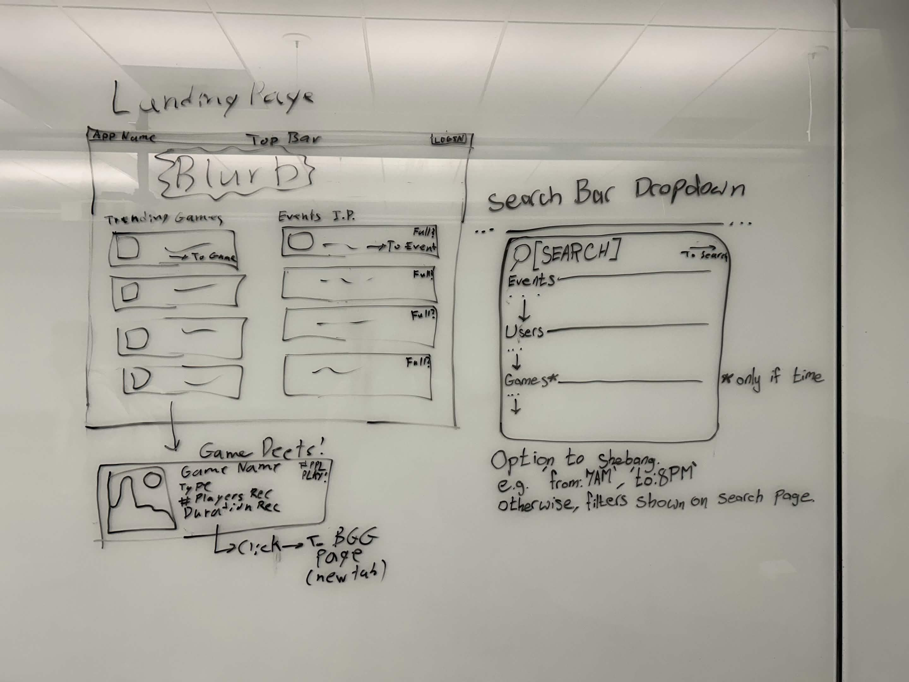
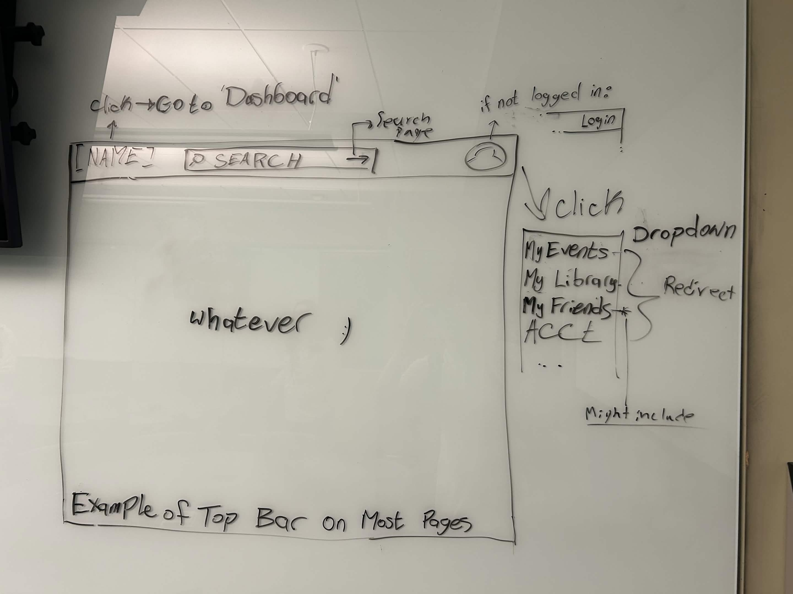
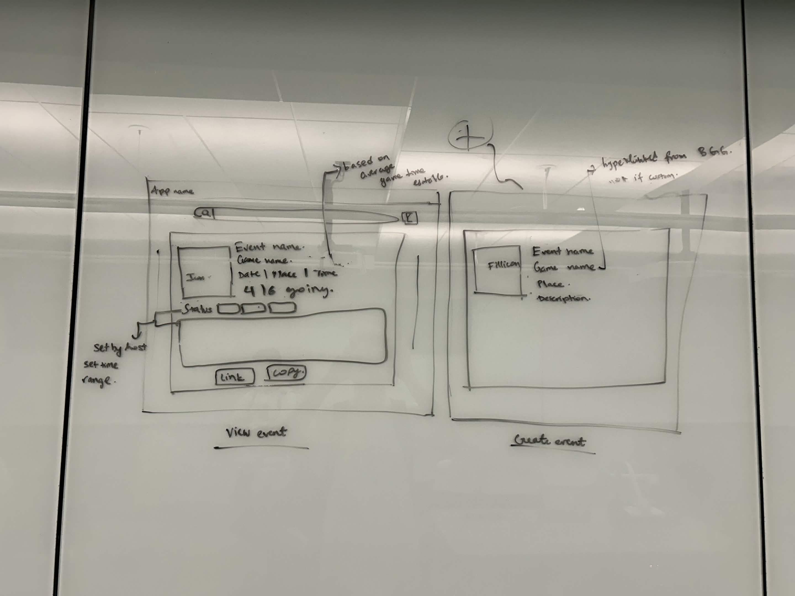
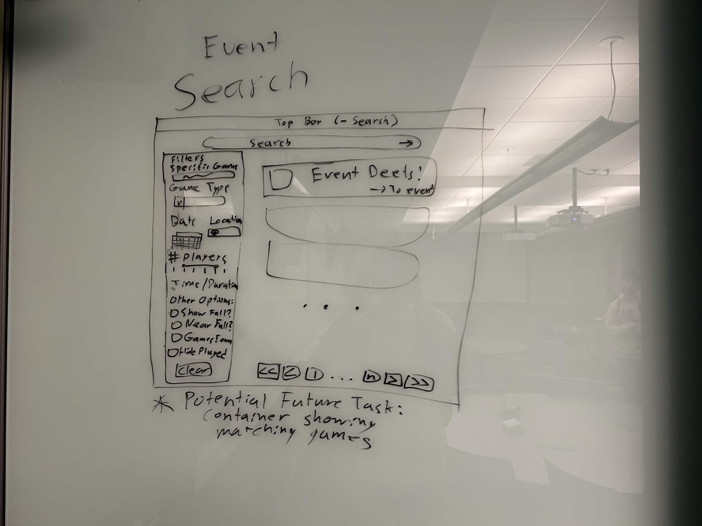
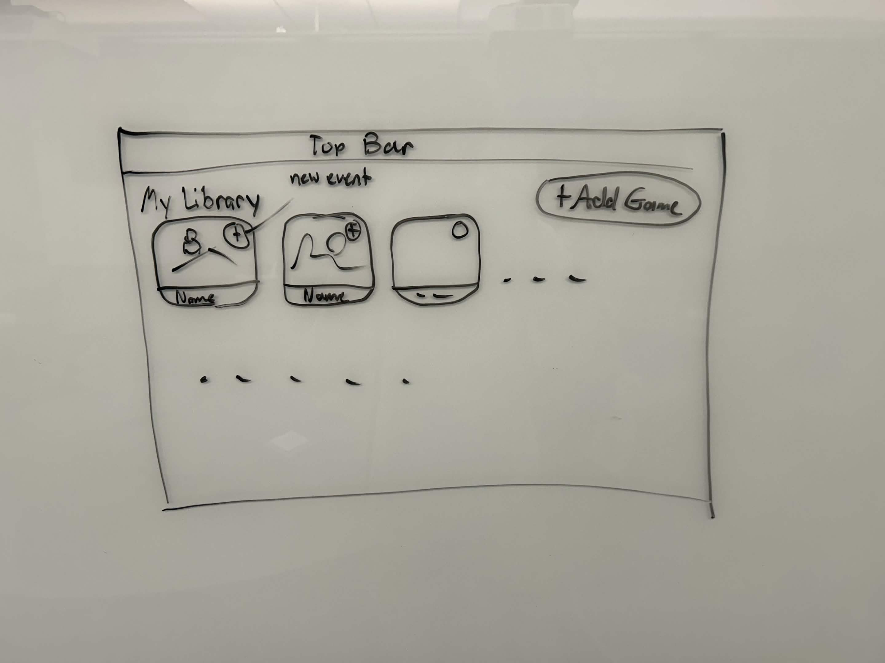
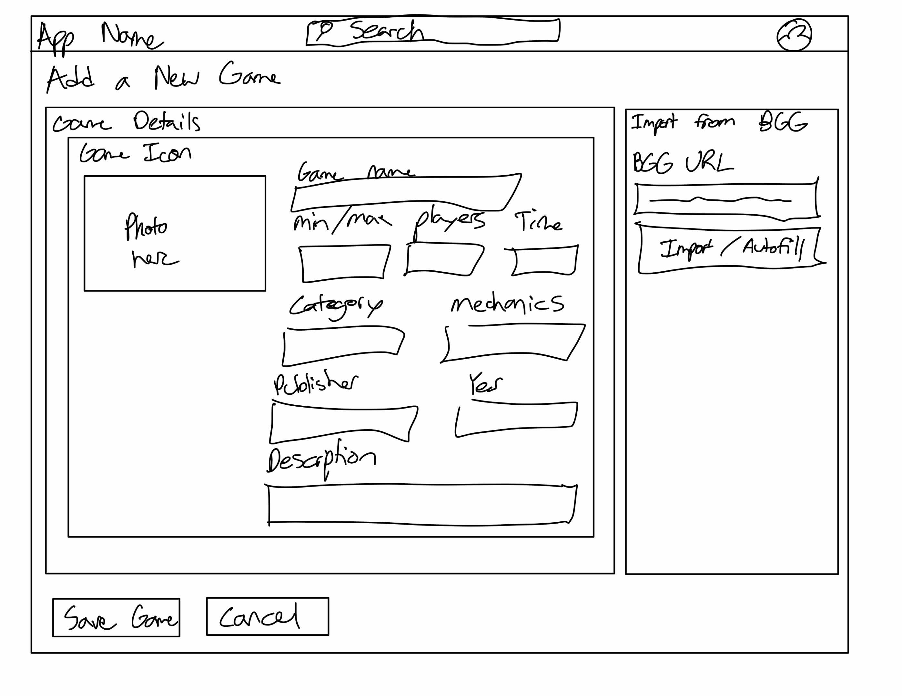
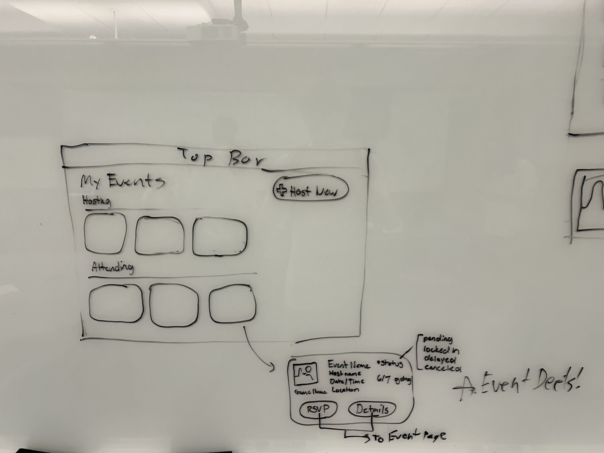

# Module 1 Group Assignment

CSCI 5117, Fall 2026, [assignment description](https://canvas.umn.edu/courses/579310/pages/project-1)

## App Info:

- Team Name: The Moneyed Monkeys 🦧
- App Name: Game Master
- App Link: <https://TODO.com/>

### Students

- Nick Hinds, hinds084@umn.edu
- Russell Shaver, shave083@umn.edu
- Marko Krstulovic, krstu002@umn.edu
- Pranshu Panda, pand068@umn.edu
- Tayler Miller, mil00154@umn.edu

## Key Features

**Describe the most challenging features you implemented
(one sentence per bullet, maximum 4 bullets):**

- ...

## Testing Notes

**Is there anything special we need to know in order to effectively test your app? (optional):**

- ...

## Screenshots of Site

**[Add a screenshot of each key page (around 4)](https://stackoverflow.com/questions/10189356/how-to-add-screenshot-to-readmes-in-github-repository)
along with a very brief caption:**

## Mock-up

There are a few tools for mock-ups. Paper prototypes (low-tech, but effective and cheap), Digital picture edition software (gimp / photoshop / etc.), or dedicated tools like moqups.com (I'm calling out moqups here in particular since it seems to strike the best balance between "easy-to-use" and "wants your money" -- the free teir isn't perfect, but it should be sufficient for our needs with a little "creative layout" to get around the page-limit)

In this space please either provide images (around 4) showing your prototypes, OR, a link to an online hosted mock-up tool like moqups.com

**[Add images/photos that show your paper prototype (around 4)](https://stackoverflow.com/questions/10189356/how-to-add-screenshot-to-readmes-in-github-repository) along with a very brief caption:**

Landing Page shows list of trending games and popular events. Here, we use "Event Details" and "Game Details" cards. Also displayed here is the Game Details card, displaying key info like the name, number of recommended players, recommended game duration and more. Clicking on the card links you to full game information using the BGG API. Also on this page is the mock-up of the search bar drop down menu that appears as you enter something in the top bar's search.

The Top Bar mock-up shows a common top menu bar. The menu bar shows the name of the app, allowing you to go to the home menu. Next to that is a lighter search bar (described in the previous mockup). Finally, if not logged in, the top right has a Login button, or a profile dropdown allowing access to various user features (such as user-associated events and games. 

The Event View pages show event details and event creation. When creating an event, a user can specify the name, game, place, image, and description of the event. Once the event is created, the host can view these details and then progress the event into a planning status. In this state, the host can either offer a scheduling option to other attendees of the event or set a manual date/time to move it to a completed/planned status. The details page allows sharing of the link.

The Event Search page provides a more comprehensive series of search options for users. It is reached by hitting enter on a search term in the top bar. Here, there is text search, augmented with a variety of filters based on games, date, location, duration, and event capacity/games played. This search offers pagination.

The My Library page offers a list of games that you own/collect to provide easy repeated access to event creation. It allows adding a game and viewing existing games.

The Add game page offers two options for entering game details. The first is a manual entry for custom games, where all of the relevant information for games can be entered. On the other hand, we will offer an option to import a game from BoardGameGeek, easily loading all of the required information for the user.

The My Events page offers a list of events that a user is hosting or attending. There is also an option to create a new event that they want to host. Each event card contains event info such as name, host username, date/time, location, status, and current attendance. These event cards are reused through the site. The cards also have buttons that allow signing up and viewing details depending on whether there is space and you are the host.

## External Dependencies

**Document integrations with 3rd Party code or services here.
Please do not document required libraries. or libraries that are mentioned in the product requirements**

- Library or service name: description of use
- ...

**If there's anything else you would like to disclose about how your project
relied on external code, expertise, or anything else, please disclose that
here:**

...
